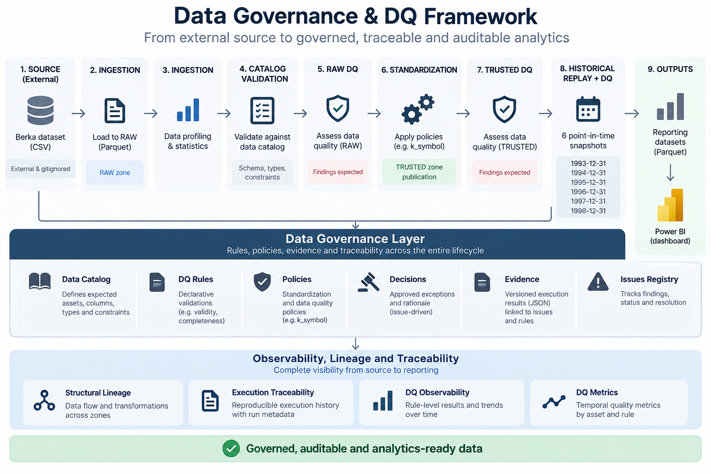
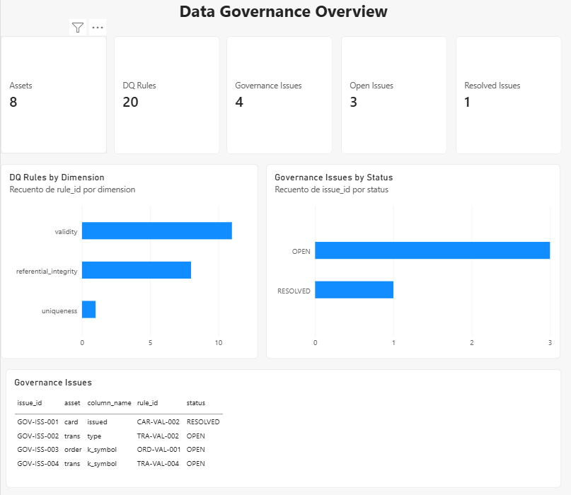
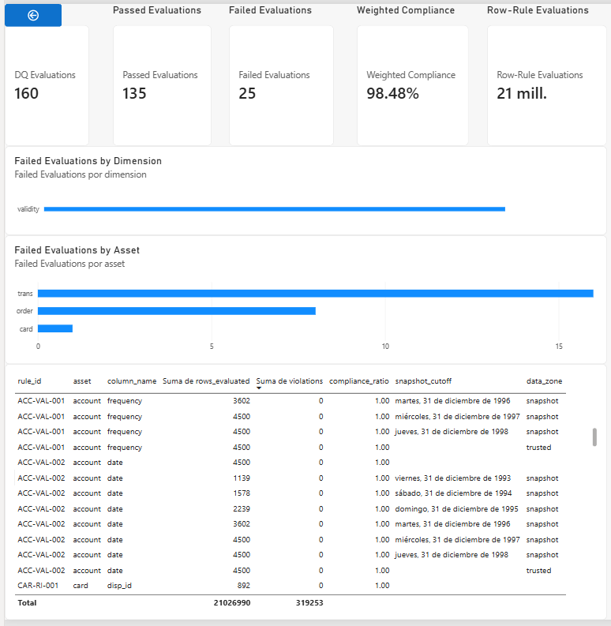
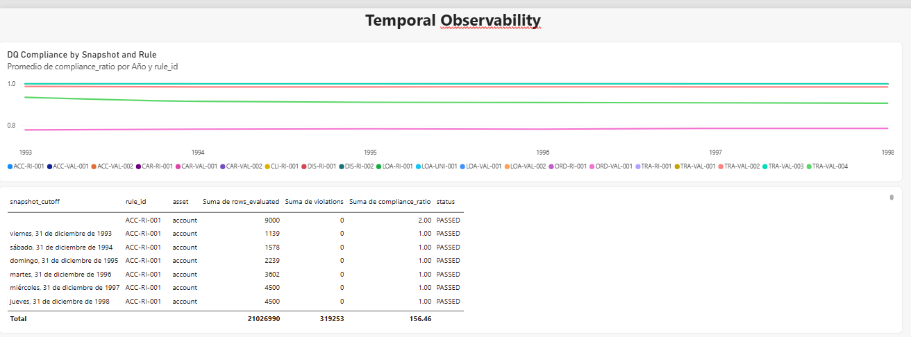
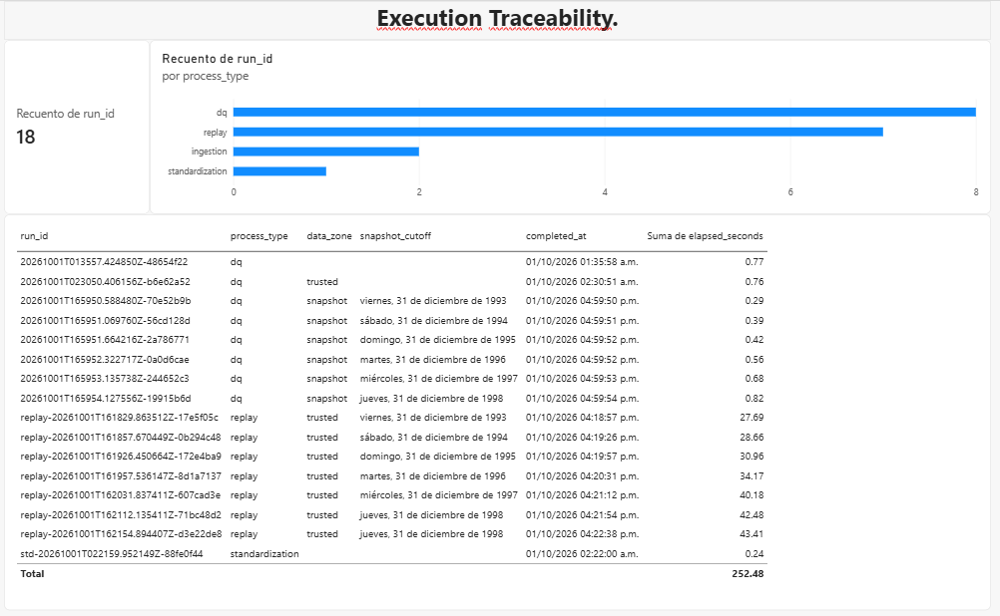

# Data Governance & Data Quality Framework

Metadata-driven Data Governance and Data Quality framework with auditable decisions, execution evidence and Power BI reporting over relational banking data.



## Purpose

This executable portfolio project makes data quality findings, authorized transformations and governance decisions inspectable and reproducible. Versioned metadata connects source definitions and declarative expectations to measured results, retained historical evidence and reporting.

The flow is **SOURCE → RAW → TRUSTED → historical snapshots → governance/observability → reporting**. DQ detects; Governance decides. TRUSTED means standardized according to approved policies, not automatically error-free.

Portfolio v1.0 includes the metadata catalog, declarative DQ rules, standardization policies, governance issues and decisions, immutable historical evidence, structural lineage, execution traceability, temporal DQ observability, eight reporting datasets and a four-page Power BI dashboard. Structural lineage describes declared relationships; execution traceability reports recorded facts. No causal relationships between runs or latest/canonical-run semantics are inferred.

## End-to-end demo

Supply the external, gitignored Berka source separately. Install dependencies
with `python -m pip install -r requirements.txt`, then run from the repository root:

```bash
python -m src.demo --source berka-source/berka-dataset
```

The wrapper uses the current Python interpreter and existing CLI modules. It
checks required source files, metadata/configuration and the three retained
historical governance evidence files before ingestion. Existing stages remain
responsible for checksum checks and semantic validation.

The sequence is ingestion, profiling, catalog, RAW DQ, standardization/TRUSTED
publication, TRUSTED DQ, replay immediately followed by snapshot DQ for each
December 31 cutoff from 1993 through 1998, lineage, execution traceability, DQ
observability, metrics/temporal observability, governance and reporting. It stops
on the first non-zero CLI exit code and reports overall SUCCESS only after
reporting completes.

The command creates additional execution history without deleting or resetting
existing records. Rule-level DQ failures are expected findings and do not mean
the engine failed: the wrapper respects the existing CLI execution status.
Retained historical governance evidence is unchanged; new runs are independent,
without latest/canonical selection or inferred causal relationships.

Successful publication rebuilds RAW, TRUSTED, the six snapshots and the derived
result layers using their existing publication contracts. Reporting produces
the eight Parquet files consumed by Power BI; the PBIX is not launched
automatically. Refresh Power BI after the command reports SUCCESS. SOURCE remains
external and gitignored; execution counts grow with repeated demos.

## Initial dataset

The initial dataset is the PKDD'99 Czech Financial Dataset (Berka Dataset), a relational banking dataset composed of eight source files covering accounts, clients, dispositions, permanent orders, transactions, loans, credit cards, and district demographic data.

The original source files are immutable project inputs. They are kept separate from RAW data, which is produced by the controlled local ingestion process rather than by manually copying source files.

## Local ingestion

Step 1A provides a manifest-driven local ingestion command. It verifies the existence, SHA-256 checksum, and physical record count of every expected source file before publishing byte-identical copies to `data/raw/`. These are source-integrity checks, not business Data Quality rules.

Install the runtime dependencies (PyYAML and DuckDB):

```bash
python -m pip install -r requirements.txt
```

Run ingestion from the repository root:

```bash
python -m src.ingestion --source berka-source/berka-dataset
```

Each run writes a JSON execution record to `data/results/ingestion/`. A failed validation returns a non-zero exit code and leaves the existing RAW dataset unchanged.

## Local profiling

Step 1B profiles the physical textual representation of every manifest-declared RAW file with DuckDB. It reports table dimensions and per-column empty, non-empty, distinct, uniqueness, lexical range, and deterministic sample measurements without converting dates, numbers, or business codes.

After a successful ingestion, run from the repository root:

```bash
python -m src.profiling
```

Use `python -m src.profiling --raw <path>` only when profiling another controlled RAW location. Each run writes a JSON result to `data/results/profiling/`. Profiling measurements are evidence, not automatic Data Quality findings or rules.

## Metadata catalog

Step 2 provides version-controlled YAML definitions for all manifest-declared assets, their documented columns and values, and source-supported relationships. Every definition identifies its source-documentation evidence; profiling measurements and governance decisions remain separate.

Validate catalog structure and RAW-header consistency from the repository root:

```bash
python -m src.catalog
```

The command reads only RAW headers and writes a JSON execution record to `data/results/catalog/`. Catalog validation checks metadata consistency; it is not business Data Quality validation.

## Metadata-driven Data Quality

Step 3 executes YAML-declared expectations against unchanged RAW files with DuckDB. The generic engine supports `allowed_values`, `regex_format`, `unique`, and `reference_exists` across the validity, uniqueness, and referential-integrity dimensions.

Run from the repository root:

```bash
python -m src.dq
```

Each run writes a JSON result to `data/results/dq/`. A successful engine execution may contain failed rules when violations are observed. Empty-string handling is explicit per rule through `empty_policy`; completeness, thresholds, global scoring, and remediation are not implemented. TRUSTED is produced separately by standardization.

RAW remains the default input. Revalidate the same rules against the separately produced TRUSTED dataset with:

```bash
python -m src.dq --data-path data/trusted --data-zone trusted
```

New DQ records include the explicit zone label and resolved physical path. Selecting TRUSTED changes only the input location and execution metadata; rule semantics are identical and DQ never transforms its input.

Step 6B reuses the same 20 rules over an existing historical snapshot:

```bash
python -m src.dq --data-path data/snapshots/1995-12-31 --data-zone snapshot --snapshot-cutoff 1995-12-31
```

Snapshot requires an explicit input path and a valid ISO cutoff. The cutoff is
declared identity, never inferred from a directory name or used to filter rows.
New RAW/TRUSTED records store `snapshot_cutoff: null`; historical JSON is unchanged.
DQ does not rebuild snapshots or verify provenance. Differences in violations or
compliance ratios between cutoffs do not automatically imply improvement or
deterioration because the evaluated population changes.

## Local DQ observability

Step 4 rebuilds a queryable DuckDB history from the immutable DQ execution JSON records:

```bash
python -m src.observability
```

The output is `data/results/observability/dq_history.duckdb`, containing `dq_runs` and `dq_rule_results`. Each build validates the complete JSON input set and publishes a full replacement atomically, so repeated builds do not duplicate rows. Zone-aware runs retain `data_zone` and `data_path`, and snapshot runs retain declared `snapshot_cutoff` as a nullable date. Legacy runs preserve unknown identity as `NULL`. The builder does not rerun DQ or read input datasets.

This is execution history, not a global DQ score or proof of improvement or deterioration. Repeated runs over unchanged RAW may naturally contain identical results.

## Policy-driven standardization and TRUSTED

Step 5 builds a complete TRUSTED dataset from RAW using only explicitly declared policies:

```bash
python -m src.standardization
```

The initial portfolio contains one policy, `CARD-STD-001`, which standardizes only exact `card.issued` values shaped as `YYMMDD 00:00:00` to the documented six-digit representation. The seven unaffected assets are copied byte-for-byte. Publication is all-or-nothing and each run writes transformation evidence under `data/results/standardization/`.

TRUSTED is not claimed to be fully clean or DQ compliant. The whitespace findings and `trans.type = VYBER` remain unchanged, and DQ is not automatically rerun after standardization.

In this project:

- **SOURCE** means the original external dataset, unchanged and outside version control.
- **RAW** means exact source files published only after validation against the dataset manifest.
- **PROFILING RESULTS** are physical measurements produced from RAW.
- **SOURCE METADATA CATALOG** contains definitions supported by source documentation.
- **DQ RULES** contain explicit executable expectations with traceable evidence.
- **DQ RESULTS** contain observed outcomes for those expectations.
- **DQ OBSERVABILITY** is a reproducible analytical projection of DQ execution records.
- **STANDARDIZATION POLICIES** authorize only explicitly declared transformations.
- **TRUSTED** contains the complete policy-standardized publication without claiming universal DQ compliance.
- **HISTORICAL SNAPSHOTS** select original TRUSTED rows by documented dates and relationships.
- **OWNERSHIP/STEWARDSHIP**, completeness rules, and DQ scoring are not implemented yet.

## Scope and limitations

The implemented framework covers profiling, cataloging, DQ validation and history,
policy-driven TRUSTED publication, post-standardization and snapshot DQ,
historical replay, structural lineage, execution traceability, governance
issues/decisions, reporting and Power BI. Completeness, ownership/stewardship,
global DQ scoring and cloud orchestration are outside the implemented v1.0 scope.
No global DQ score is invented.

## Historical snapshots

Step 6A selects original TRUSTED rows using metadata-declared temporal, reference,
combined, and static strategies:

```bash
python -m src.replay --cutoff 1993-12-31
```

The cutoff is inclusive. Each build publishes all eight assets under
`data/snapshots/<YYYY-MM-DD>/` and records execution evidence in
`data/results/replay/`. Invalid dates or required orphan references fail the build;
a failed rebuild preserves the previous snapshot. Replay preserves original rows
without cleaning or transforming values. Assets without documented validity are
selected by relationships or copied fully; this is not a complete reconstruction
of historical knowledge. See [historical replay architecture](docs/architecture/historical_replay.md).

## Structural lineage

Step 7A projects the current metadata and explicit framework contracts into a queryable graph:

```bash
python -m src.lineage
```

The output is `data/results/lineage/lineage.duckdb`, containing only `lineage_nodes` and `lineage_edges`. It describes asset flows, authorized column transformations with policy context, DQ applicability, and documented logical relationships. The builder reads metadata and source contracts without reading datasets or execution history. SNAPSHOT has no cutoff or instance identity in this graph. Builds replace the projection atomically and retain deterministic logical IDs. See [data lineage architecture](docs/architecture/data_lineage.md) for the model, evidence, limitations, and acceptance SQL.

## Portfolio v1.0 status

**Step 12 - End-to-End Demo.** A thin CLI wrapper runs the existing stages through reporting; see the command and prerequisites below.

**Step 11B - Power BI Dashboard.** The manually completed dashboard presents governance, DQ results, temporal observability and recorded execution facts in four pages. See the screenshots and semantics below.

**Step 11A - Power BI Reporting Layer.** Run `python -m src.reporting` to publish exactly eight typed Parquet datasets under `data/results/reporting/` from read-only Metrics, Governance, Execution Traceability and Structural Lineage databases. The reporting model retains denominators, all run identities and snapshot cutoffs. See [reporting architecture](docs/architecture/reporting_layer.md) for schemas, relationships, publication and refresh boundaries.

**Step 10 - Governance Issues & Decisions.** Run `python -m src.governance` to validate version-controlled issue/decision declarations and rebuild `data/results/governance/governance_registry.duckdb`. Four issues and four explicit decisions reference existing metadata and original execution evidence. Withholding remediation is declared in Step 10; it is never inferred from missing transformations. Actor and decision date remain NULL, and execution runs are not connected through inferred causal dependencies. See [governance decisions](docs/architecture/governance_decisions.md).

Step 9 temporal DQ observability remains available through four snapshot views in the existing metrics database, preserving denominators and independent run IDs without automatic temporal classifications. See [temporal observability](docs/architecture/temporal_observability.md), [DQ metrics architecture](docs/architecture/data_quality_metrics.md), and [execution traceability architecture](docs/architecture/execution_traceability.md). Completeness, global scoring, and cloud components remain outside the v1.0 scope.

## Power BI Dashboard

Step 11B is available in [data-governance-dq-dashboard.pbix](dashboards/data-governance-dq-dashboard.pbix). Power BI consumes the existing reporting results; it does not rebuild the framework's DQ or governance logic.

**Data Governance Overview** shows assets, DQ rules, governance issues, open/resolved counts, rules by dimension, issue states and issue detail.



**Data Quality** shows evaluation counts and passed/failed records, weighted compliance, row-rule evaluations, failures by dimension/asset and evaluation detail. Failed Evaluations counts failed evaluation records, not failed rules or bad rows. Row-Rule Evaluations counts evaluated row-rule pairs. Weighted Compliance is total conforming row-rule evaluations divided by total evaluated row-rule evaluations, not a simple average of compliance ratios or a global score.



**Temporal Observability** shows compliance by snapshot and rule alongside snapshot evaluation history. `snapshot_cutoff` is the business/historical cutoff, distinct from execution time. Changing snapshot populations do not imply automatic quality improvement/degradation; no automatic trend labels are assigned.



**Execution Traceability** shows recorded execution runs, counts by process type and run history. These are recorded execution facts; the dashboard does not infer causal relationships between runs. Screenshots show the state at capture time; execution counts grow when the demo is repeated.



See [`docs/source/dataset_assessment.md`](docs/source/dataset_assessment.md) for the source baseline, [`config/dataset_manifest.yaml`](config/dataset_manifest.yaml) for expected files, [`docs/architecture/local_ingestion.md`](docs/architecture/local_ingestion.md) for ingestion, [`docs/architecture/local_profiling.md`](docs/architecture/local_profiling.md) for profiling, [`docs/architecture/metadata_catalog.md`](docs/architecture/metadata_catalog.md) for the catalog, [`docs/architecture/data_quality.md`](docs/architecture/data_quality.md) for DQ semantics, [`docs/architecture/dq_observability.md`](docs/architecture/dq_observability.md) for history, and [`docs/architecture/standardization_trusted.md`](docs/architecture/standardization_trusted.md) for TRUSTED publication.
